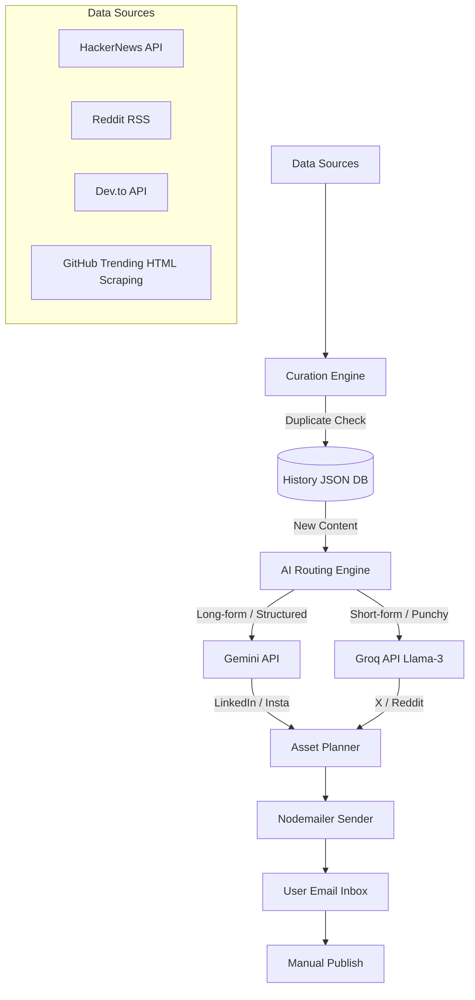

# Plan: Tech Content Curator & Post Planner (V2 Architecture)

This plan outlines the architecture, data sources, and implementation steps to build an **advanced, multi-model daily curation digest**. It gathers trending tech news, shortcuts, and open-source projects, generates drafts using specialized AI models (Groq and Gemini), suggests media assets, and delivers them to your email.

---

## 🏗️ System Architecture (V2)

---

## 📡 1. Enhanced Data Sources & Curation

*   **HackerNews API:** Fetching top technical stories.
*   **Reddit API/RSS:** Curating top posts from `/r/technology`.
*   **Dev.to API:** Fetching trending software development articles.
*   **GitHub Trending:** Scraping top trending repos to share open-source tools.
*   **Closed-Loop Tracking:** A `history.json` database ensures no article or repo is ever posted twice.

---

## 🧠 2. Multi-Model AI Routing

Instead of relying on a single AI, tasks are routed to the most capable (and free) model:

1.  **Google Gemini (Gemini 1.5 Flash):** Handles large contexts. Writes structured **LinkedIn Posts** and designs **Instagram Carousels**.
2.  **Groq API (Llama 3 70B):** Extremely fast generation. Writes short, punchy **X (Twitter) tweets** and conversational **Reddit titles/captions**.

---

## 🎨 3. Automated Asset Finder (GIFs & Images)

*   Generates Giphy and Unsplash search links based on keywords extracted by Gemini.
*   *(Future expansion: Integrate Unsplash API for direct raw image downloading).*

---

## ✉️ 4. Email Digest Structure

The HTML email sent daily includes:
*   🔥 Top non-duplicate Tech Stories.
*   📝 Specialized drafts (LinkedIn, X, Reddit, Instagram).
*   ⌨️ Productivity Shortcut of the Day.

---

## 🚀 5. Execution Steps
1.  **Multi-Model API:** Setup both `@google/generative-ai` and `groq-sdk`.
2.  **Generators:** Update `X` and `Reddit` modules to use `groq.js`.
3.  **Fetchers:** Add GitHub scraper.
4.  **Database:** Implement `history.json` to filter out old articles.
5.  **Digest Orchestration:** Run everything and send via Nodemailer.
